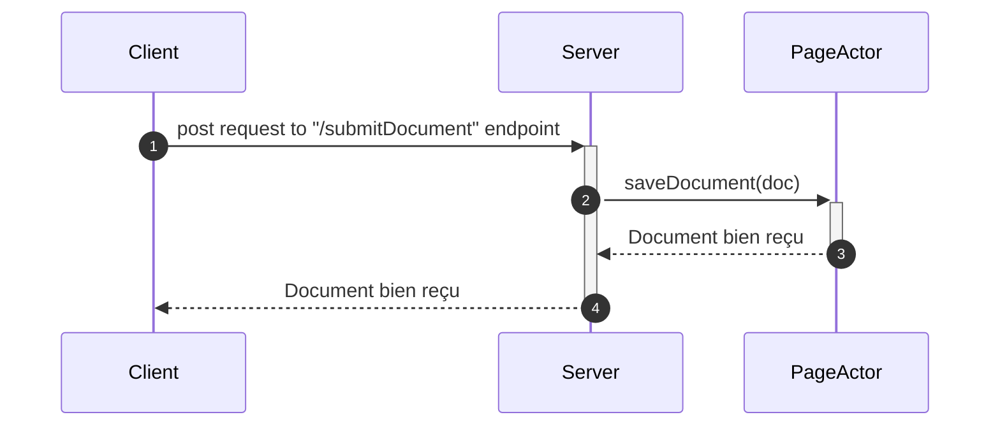
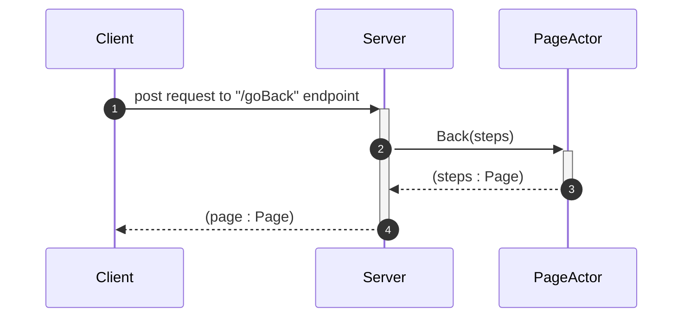
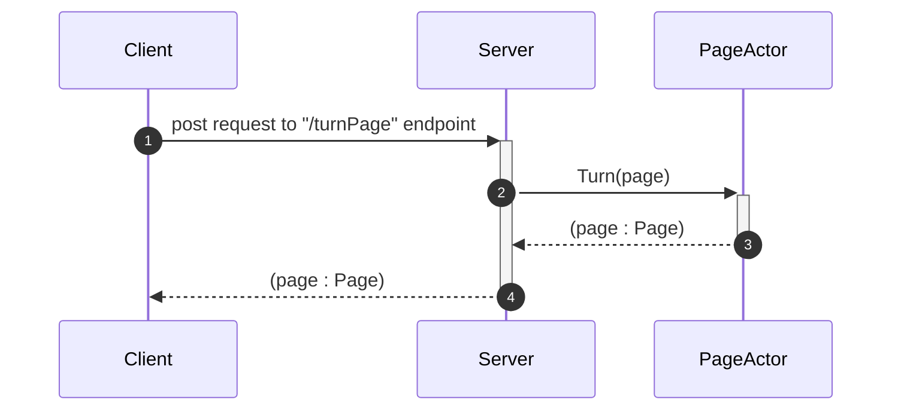
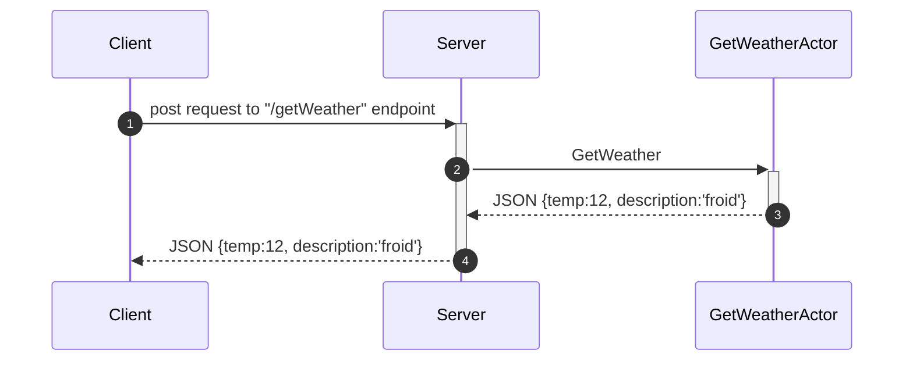
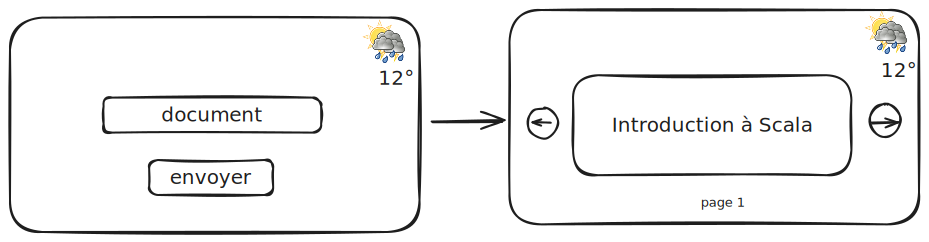

# Votre API de Présentation

No description provided (generated by Openapi Generator https://github.com/openapitools/openapi-generator)

    ## API

          ### GetWeather

          |Name|Role|
          |----|----|
          |`org.openapitools.server.api.GetWeatherController`|akka-http API controller|
          |`org.openapitools.server.api.GetWeatherApi`|Representing trait|
              |`org.openapitools.server.api.GetWeatherApiImpl`|Default implementation|

                * `GET /getWeather` - Obtenir les données météorologiques

          ### GoBack

          |Name|Role|
          |----|----|
          |`org.openapitools.server.api.GoBackController`|akka-http API controller|
          |`org.openapitools.server.api.GoBackApi`|Representing trait|
              |`org.openapitools.server.api.GoBackApiImpl`|Default implementation|

                * `POST /goBack` - Revenir en arrière dans le document

          ### SubmitDocument

          |Name|Role|
          |----|----|
          |`org.openapitools.server.api.SubmitDocumentController`|akka-http API controller|
          |`org.openapitools.server.api.SubmitDocumentApi`|Representing trait|
              |`org.openapitools.server.api.SubmitDocumentApiImpl`|Default implementation|

                * `POST /submitDocument` - Permet de soumettre le document à lire

          ### TurnPage

          |Name|Role|
          |----|----|
          |`org.openapitools.server.api.TurnPageController`|akka-http API controller|
          |`org.openapitools.server.api.TurnPageApi`|Representing trait|
              |`org.openapitools.server.api.TurnPageApiImpl`|Default implementation|

                * `POST /turnPage` - Tourner une page du document

## Diagrammes de séquence

### Envoi de document

	
### Changement de page en arrière 

### Changement de page en avant

### Recuperation du temps qu'il fait à Paris

## Curls
Pour soummettre un document:

  curl -X POST -H "Content-Type: application/json" -d '[
  {"content": "page1"},
  {"content": "page2"},
  {"content": "page3"}
]' http://localhost:8081/submitDocument

Pour tourner la page vers la page suivante:

 curl -X POST -H "Content-Type: application/json" -d '{}' http://localhost:8081/turnPage

Pour tourner la page vers la page precedente:

 curl -X POST -H "Content-Type: application/json" -d '{}' http://localhost:8081/goBack

## interface graphique

